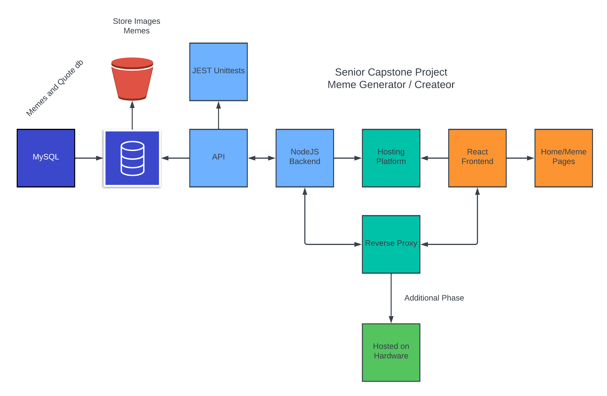

# MemeGen - Senior Capstone - John Karow
## The Problem
The problem that I am trying to solve is the ability to easily make your own memes. I want to be able to use existing templates and quotes to make content that is enjoyable to look at. Making your own memes is relatively tedious if you are using a tool such as MS Paint... You have to find images, download them, find what fonts that you want, find something funny, and then crop things until it looks okay, then you have to export it. This is a relatively long process that I want to centralize and simplify.

## Intended Functionality
- Presized templates
- A collection of memes for reference
- A collection of quotes that can be used
- The ability to insert your own meme or quote
- Being able to export a meme to a user's computer 

## Intended Features
- Being able to input an image to use as a meme template
    - This allows a user to have a more customizable experience which provides better user satisfaction,
- Inputing user quotes as the text of a meme
    - Allows the user to be creative with the memes that they create.
- A database of templates for memes
    - Allows the user to create a meme without having to bring in any data.
    - Also allows for the website to have more features and other use cases.
- The ablilty to customize the meme visually in the Front End code.
    - This makes the website more original and the user can make content unique to them.

## Technical Specifications
- Languages:
    - Frontend - ReactJS
    - Backend - NodeJS
    - Database - MySQL

- Technologies
    - AWS S3 Buckets
    - Environment - Server
    - Browser - Local Storage/Cookies

- Libraries NodeJS/React
    - Axios 
    - MySql
    - Dotenv
    - Express
    - Winston
    - Swagger
    - Jest
    - Supertest

### Technical Documentation

## Timeline
### Phase 0
- Database Creates
    - Dummy data created
- Frontend Home Page
- Backend
    - Linked to database
    - Load content from database to home endpoint
    - Endpoints in development 
- Frontend / Backend Linked 

### Phase 1
- User is able to create a meme from templates
- User is able to create a meme from custom inputs
- User is able to export a meme from the website
- Unit testing has been completed
- S3 Bucket implementation complete

### Phase 2 
- Everything is working locally
    - Can create memes
    - Customize fonts/color
    - Import meme images and use them
- Frontend is well polished and all features are handled well
- No crashes
- Backend is fully tested and all endpoints are complete
- Documentation has been completed
- Github has up to date description and README
    - Able to replicate database and run locally 

### Additional Phases
- Host the app on a server 
- Purchase a url 
- Do the proper networking and security implementations
